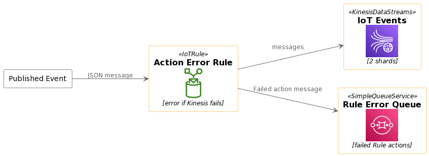

<h1>Building an Efficient AWS IoT Data Processing Workflow</h1> 

<h2>Introduction</h2>

The Internet of Things (IoT) has revolutionized the way we collect and analyze data from various devices and sensors. AWS (Amazon Web Services) offers a powerful suite of services to help organizations efficiently process and manage IoT data. In this tutorial, we'll walk you through the process of building a robust IoT data processing workflow using AWS services. 
 

<b>Scenario Description</b>

Let's consider a scenario where an organization, an IoT solutions provider, leverages AWS services to process and analyze data generated by their IoT devices. This tutorial focuses on a part of their architecture where they've implemented an AWS-based data processing workflow. 
 

<b>1. Infrastructure Overview</b>

The organization's AWS-based infrastructure consists of several AWS services configured to handle IoT data efficiently. Key components include:

Amazon Kinesis Data Streams: Used for ingesting and processing data from IoT devices.
IoT Rules: Define rules to manage and process incoming data, especially when making decisions based on data content.
Amazon Simple Queue Service (SQS): Handles error messages and failed data processing.

<b>2. IoT Data Ingestion</b>

IoT devices deployed across various locations generate JSON-formatted messages, representing telemetry data, sensor readings, and other IoT-related information. These messages are sent to the organization's AWS environment for further processing. 
 

<b>3. IoT Rule for Error Handling</b>

The organization has defined an IoT rule named "Action Error Rule" to manage data processing. This rule is responsible for:

Processing incoming JSON messages.
Making decisions based on data content.
Flagging messages as errors if any issues occur during processing, especially when problems are detected with the Kinesis Data Streams service.

<b>4. Kinesis Data Streams for Data Processing</b>

Amazon Kinesis Data Streams plays a pivotal role in handling and processing IoT events. It is configured with 2 shards to efficiently manage the incoming data load. Here's how data flows through this component:

IoT messages pass through the IoT rule for initial processing.
They are then seamlessly sent to the Kinesis Data Streams for further, scalable processing.

<b>5. Error Handling with SQS</b>

In scenarios where processing failures or errors are flagged by the IoT rule, the failed messages are routed to an Amazon Simple Queue Service (SQS) queue named "Rule Error Queue." This SQS queue acts as a buffer, holding messages that require manual intervention or reprocessing. 
 

<b>6. Security and Reliability</b>

To ensure data integrity and reliability, the organization takes several measures:

They maintain a secure and highly available AWS environment.
Robust access control mechanisms are implemented.
Data is encrypted to protect sensitive IoT information.
Monitoring tools are employed to track data flows and system health.

<b>Conclusion</b>

In this tutorial, we've explored a real-world scenario where an organization leverages AWS services to build an efficient IoT data processing workflow. By using Amazon Kinesis Data Streams, IoT rules, and Amazon Simple Queue Service, they ensure that IoT data is processed reliably and that errors are managed effectively. This architecture enables a scalable and robust solution for processing IoT data, demonstrating the power of AWS in managing IoT workloads.

Building your own IoT data processing workflow on AWS is now within reach. By following this example and leveraging AWS services, you can effectively manage and process IoT data, contributing to the success of your IoT projects.
